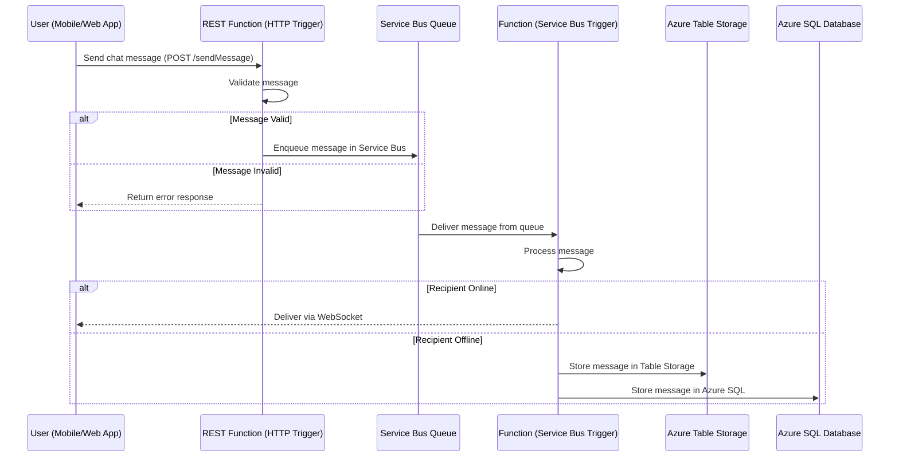

# ChatService


### **Chat Messaging System**

This section provides an in-depth look at the first five steps of the chat messaging system, covering how a message is **ingested, processed, and stored** before being delivered to its intended recipient.

---
## **Mermaid Diagram**

---

## **1. User Sends a Chat Message via the Client Application**
- The user initiates a message from a **mobile app** or **web application**.
- The front-end **constructs a JSON payload** containing:
  - `SenderID` (user who sent the message)
  - `ReceiverID` (intended recipient of the message)
  - `Timestamp` (when the message was sent)
  - `MessageText` (actual message content)
  - `AttachmentURL` (if applicable)
- This payload is then sent via an HTTP POST request to an **Azure Function (HTTP Trigger)**.
- The HTTP API endpoint might look like this:

```
POST https://chat-functions.azurewebsites.net/api/sendMessage
Content-Type: application/json
```

**Example Payload:**
```json
{
  "SenderID": "user123",
  "ReceiverID": "user456",
  "Timestamp": "2025-02-11T12:30:45Z",
  "MessageText": "Hey, how's it going?",
  "AttachmentURL": null
}
```

---

## **2. Azure Function (HTTP Trigger) Receives the Request**
- The **Azure Function (HTTP Trigger)** acts as the **entry point** for the chat system.
- It receives the JSON payload and **validates the message**:
  - Checks for empty or malformed requests.
  - Scans the message for spam or offensive content.
  - If an attachment is included, generates a **SAS URL** for secure upload to **Azure Blob Storage**.
- After validation, the function **logs the request** for observability in **Azure Monitor**.
- If the request passes validation, the function **forwards it to Azure Service Bus**.


---

## **3. Message is Enqueued in Azure Service Bus**
- The **Azure Function enqueues the chat message** into an **Azure Service Bus Queue or Topic**.
- Service Bus ensures **asynchronous and durable message delivery**.
- **Why Service Bus?**
  - **Guaranteed delivery** even if the receiver is offline.
  - **Scalability**: Service Bus can handle millions of messages per second.
  - **Pub/Sub Support**: Can fan out messages to multiple recipients for group chats.

**Azure Service Bus Configuration:**
- **Queue Name:** `chat-queue`
- **Topic Name:** `chat-topic` (for group messaging)
- **Subscription:** `chat-subscription`

**Service Bus Message Structure:**
```json
{
  "SenderID": "user123",
  "ReceiverID": "user456",
  "MessageText": "Hey, how's it going?",
  "Timestamp": "2025-02-11T12:30:45Z"
}
```

---

## **4. Azure Function (Service Bus Trigger) Processes Messages**
- A **Service Bus-triggered Azure Function** continuously listens to the queue.
- When a message arrives, the function **processes and determines the recipient’s status**:
  - If **recipient is online**, the message is pushed to the client in real-time.
  - If **recipient is offline**, the message is persisted in **Azure SQL Database** or **Azure Table Storage**.


---

## **5. Message is Stored in Azure SQL or Azure Table Storage**
- If the recipient is offline, the message is stored for later retrieval.
- **Azure Table Storage** is used for fast retrieval of chat messages.
- **Azure SQL Database** is used if structured querying and relationships are needed.

### **Table Storage Schema**
| **PartitionKey (ReceiverID)** | **RowKey (Timestamp)** | **SenderID** | **MessageText** |
|---------------------|---------------------|----------|--------------|
| `user456` | `2025-02-11T12-30-45Z` | `user123` | `"Hey, how's it going?"` |

> **Note:**  Remote configuration

|Key|Value | Comment|
|:----|:----|:----|
|AzureWebJobsStorage|[CONNECTION STRING]|RECOMMENDATION :  store in Azure Key Vault.|
|ApiStore|Store and manage WorkFlow configuration files remotely  |
|ApiKeyName|[API KEY NAME]|Will be passed in the header  :  the file name of the config.
|AppName| [APPLICATION NAME]| This is the name of the Function App, used in log analytics|
|StorageAcctName|[STORAGE ACCOUNT NAME]|Example  "AzureWebJobsStorage"|
|EncryptionToken|Generate Encryption Key | Generate a encryption key. Store in Azure Key Vault |

---


## **Key Takeaways**
1. **Event-Driven Approach**: Azure Functions and Service Bus ensure high scalability.
2. **Asynchronous Processing**: Messages are enqueued and processed reliably.
3. **Storage Options**: Table Storage for NoSQL access, Azure SQL for structured queries.
4. **Real-Time Delivery**: WebSockets notify users instantly if they’re online.
5. **Offline Persistence**: Messages are stored for offline users and retrieved later.


## **Database Tables **

### **Azure SQL Database Schema for a Twitter-Like Chat Messaging Service**  

The schema for a **Twitter-like messaging system** should support:
- **Users** (profile, authentication, metadata)
- **Messages** (tweets, direct messages, mentions)
- **Followers/Following** (social connections)
- **Likes, Retweets, Hashtags** (engagement tracking)
- **Media Storage** (attachments)
- **Notifications** (real-time updates)

---

## **1. Users Table**
Stores user profile details, authentication, and metadata.

```sql
CREATE TABLE Users (
    UserID UNIQUEIDENTIFIER PRIMARY KEY DEFAULT NEWID(),
    Username NVARCHAR(50) UNIQUE NOT NULL,
    Email NVARCHAR(255) UNIQUE NOT NULL,
    PasswordHash NVARCHAR(512) NOT NULL,
    DisplayName NVARCHAR(100) NOT NULL,
    Bio NVARCHAR(255),
    ProfileImageURL NVARCHAR(512),
    CreatedAt DATETIME DEFAULT GETUTCDATE(),
    LastLogin DATETIME NULL
);
```

---

## **2. Tweets Table**
Stores individual tweets and their metadata.

```sql
CREATE TABLE Tweets (
    TweetID UNIQUEIDENTIFIER PRIMARY KEY DEFAULT NEWID(),
    UserID UNIQUEIDENTIFIER FOREIGN KEY REFERENCES Users(UserID) ON DELETE CASCADE,
    TweetText NVARCHAR(280) NOT NULL,
    MediaURL NVARCHAR(512) NULL,
    CreatedAt DATETIME DEFAULT GETUTCDATE(),
    RetweetCount INT DEFAULT 0,
    LikeCount INT DEFAULT 0
);
```

---

## **3. Direct Messages Table**
Stores private chat messages between users.

```sql
CREATE TABLE DirectMessages (
    MessageID UNIQUEIDENTIFIER PRIMARY KEY DEFAULT NEWID(),
    SenderID UNIQUEIDENTIFIER FOREIGN KEY REFERENCES Users(UserID) ON DELETE CASCADE,
    ReceiverID UNIQUEIDENTIFIER FOREIGN KEY REFERENCES Users(UserID) ON DELETE CASCADE,
    MessageText NVARCHAR(1000) NOT NULL,
    MediaURL NVARCHAR(512) NULL,
    SentAt DATETIME DEFAULT GETUTCDATE(),
    IsRead BIT DEFAULT 0
);
```

---

## **4. Followers Table**
Tracks user relationships (who follows whom).

```sql
CREATE TABLE Followers (
    FollowerID UNIQUEIDENTIFIER FOREIGN KEY REFERENCES Users(UserID) ON DELETE CASCADE,
    FollowingID UNIQUEIDENTIFIER FOREIGN KEY REFERENCES Users(UserID) ON DELETE CASCADE,
    FollowedAt DATETIME DEFAULT GETUTCDATE(),
    PRIMARY KEY (FollowerID, FollowingID)
);
```

---

## **5. Likes Table**
Tracks tweets liked by users.

```sql
CREATE TABLE Likes (
    LikeID UNIQUEIDENTIFIER PRIMARY KEY DEFAULT NEWID(),
    UserID UNIQUEIDENTIFIER FOREIGN KEY REFERENCES Users(UserID) ON DELETE CASCADE,
    TweetID UNIQUEIDENTIFIER FOREIGN KEY REFERENCES Tweets(TweetID) ON DELETE CASCADE,
    LikedAt DATETIME DEFAULT GETUTCDATE()
);
```

---

## **6. Retweets Table**
Tracks retweets and their references.

```sql
CREATE TABLE Retweets (
    RetweetID UNIQUEIDENTIFIER PRIMARY KEY DEFAULT NEWID(),
    UserID UNIQUEIDENTIFIER FOREIGN KEY REFERENCES Users(UserID) ON DELETE CASCADE,
    OriginalTweetID UNIQUEIDENTIFIER FOREIGN KEY REFERENCES Tweets(TweetID) ON DELETE CASCADE,
    RetweetText NVARCHAR(280) NULL,
    RetweetedAt DATETIME DEFAULT GETUTCDATE()
);
```

---

## **7. Hashtags Table**
Tracks hashtags used in tweets.

```sql
CREATE TABLE Hashtags (
    HashtagID UNIQUEIDENTIFIER PRIMARY KEY DEFAULT NEWID(),
    Hashtag NVARCHAR(100) UNIQUE NOT NULL
);
```

---

## **8. TweetHashtags Table**
Associates tweets with hashtags.

```sql
CREATE TABLE TweetHashtags (
    TweetID UNIQUEIDENTIFIER FOREIGN KEY REFERENCES Tweets(TweetID) ON DELETE CASCADE,
    HashtagID UNIQUEIDENTIFIER FOREIGN KEY REFERENCES Hashtags(HashtagID) ON DELETE CASCADE,
    PRIMARY KEY (TweetID, HashtagID)
);
```

---

## **9. Media Storage Table**
Stores metadata for images, videos, and GIFs.

```sql
CREATE TABLE Media (
    MediaID UNIQUEIDENTIFIER PRIMARY KEY DEFAULT NEWID(),
    UserID UNIQUEIDENTIFIER FOREIGN KEY REFERENCES Users(UserID) ON DELETE CASCADE,
    TweetID UNIQUEIDENTIFIER NULL FOREIGN KEY REFERENCES Tweets(TweetID) ON DELETE CASCADE,
    DirectMessageID UNIQUEIDENTIFIER NULL FOREIGN KEY REFERENCES DirectMessages(MessageID) ON DELETE CASCADE,
    MediaURL NVARCHAR(512) NOT NULL,
    MediaType NVARCHAR(50) NOT NULL, -- (image, video, gif)
    UploadedAt DATETIME DEFAULT GETUTCDATE()
);
```

---

## **10. Notifications Table**
Stores user notifications (mentions, likes, new followers).

```sql
CREATE TABLE Notifications (
    NotificationID UNIQUEIDENTIFIER PRIMARY KEY DEFAULT NEWID(),
    UserID UNIQUEIDENTIFIER FOREIGN KEY REFERENCES Users(UserID) ON DELETE CASCADE,
    NotificationType NVARCHAR(50) NOT NULL, -- (mention, like, retweet, follow, message)
    ReferenceID UNIQUEIDENTIFIER NOT NULL, -- (TweetID, UserID, MessageID)
    IsRead BIT DEFAULT 0,
    CreatedAt DATETIME DEFAULT GETUTCDATE()
);
```

---

## **Indexes and Performance Optimization**
1. **Index for fast lookups on tweets by user:**
   ```sql
   CREATE INDEX idx_user_tweets ON Tweets(UserID, CreatedAt DESC);
   ```
2. **Index for fetching recent messages:**
   ```sql
   CREATE INDEX idx_messages_receiver ON DirectMessages(ReceiverID, SentAt DESC);
   ```
3. **Index for fast hashtag searches:**
   ```sql
   CREATE INDEX idx_hashtag_lookup ON Hashtags(Hashtag);
   ```
4. **Index for checking user follows:**
   ```sql
   CREATE INDEX idx_followers ON Followers(FollowerID, FollowingID);
   ```


   To verify a password in **Azure SQL Database**, we need to:  
1. **Retrieve** the stored hashed password and salt from the database.  
2. **Recreate the hash** using the provided plaintext password and the stored salt.  
3. **Compare** the computed hash with the stored hash.  

---

Here’s a stored procedure to hash and salt passwords in **Azure SQL Database** using **SHA2_512** hashing. This procedure ensures secure storage of user passwords by adding a random salt before hashing.

---

### **Stored Procedure to Salt and Hash Passwords**
```sql
CREATE PROCEDURE SaltAndHashPassword
    @UserId uniqueidentifier,
    @PlainTextPassword NVARCHAR(256)
AS
BEGIN
    SET NOCOUNT ON;

    -- Generate a random salt (16 bytes, converted to HEX)
    DECLARE @Salt VARBINARY(16) = CRYPT_GEN_RANDOM(16);

    -- Convert salt to a HEX string for storage
    DECLARE @SaltHex NVARCHAR(64) = CONVERT(NVARCHAR(64), @Salt, 1);

    -- Concatenate password with salt and hash using SHA2_512
    DECLARE @HashedPassword VARBINARY(64) = HASHBYTES('SHA2_512', @PlainTextPassword + @SaltHex);

    -- Convert the hashed password to a HEX string for storage
    DECLARE @HashedPasswordHex NVARCHAR(128) = CONVERT(NVARCHAR(128), @HashedPassword, 1);

    -- Update or Insert into the Users table
    UPDATE Users
    SET PasswordHash = @HashedPasswordHex, PasswordSalt = @SaltHex
    WHERE UserId = @UserId;

    IF @@ROWCOUNT = 0
    BEGIN
        INSERT INTO Users (UserId, PasswordHash, PasswordSalt)
        VALUES (@UserId, @HashedPasswordHex, @SaltHex);
    END
END;
```

---

### **Explanation**
1. **Generate a Salt:**  
   - Uses `CRYPT_GEN_RANDOM(16)` to generate a 16-byte salt.
   - Converts it to a HEX string for easy storage.

2. **Hashing the Password:**  
   - Concatenates the plaintext password with the salt.
   - Uses `HASHBYTES('SHA2_512', password + salt)` for hashing.

3. **Storing the Hash & Salt:**  
   - Converts both hash and salt to **HEX strings**.
   - Updates the existing user’s password or inserts a new record.

---

### **User Table Schema**
Ensure your **Users** table includes the necessary columns:
```sql
CREATE TABLE Users (
    UserId INT PRIMARY KEY,
    HashedPassword NVARCHAR(128) NOT NULL,
    Salt NVARCHAR(64) NOT NULL
);
```

---

### **Usage Example**
```sql
EXEC SaltAndHashPassword @UserId = 1, @PlainTextPassword = 'MySecurePass123!';
```


### **Stored Procedure to Verify a Password**
```sql
CREATE PROCEDURE VerifyPassword
    @UserId INT,
    @PlainTextPassword NVARCHAR(256),
    @IsValid BIT OUTPUT
AS
BEGIN
    SET NOCOUNT ON;

    -- Retrieve stored hashed password and salt for the user
    DECLARE @StoredHashedPassword NVARCHAR(128);
    DECLARE @StoredSalt NVARCHAR(64);

    SELECT @StoredHashedPassword = HashedPassword, @StoredSalt = Salt
    FROM Users
    WHERE UserId = @UserId;

    -- If user not found, return invalid
    IF @StoredHashedPassword IS NULL OR @StoredSalt IS NULL
    BEGIN
        SET @IsValid = 0;
        RETURN;
    END

    -- Recreate the hashed password using stored salt
    DECLARE @ComputedHash VARBINARY(64) = HASHBYTES('SHA2_512', @PlainTextPassword + @StoredSalt);
    DECLARE @ComputedHashHex NVARCHAR(128) = CONVERT(NVARCHAR(128), @ComputedHash, 1);

    -- Compare stored and computed hashes
    IF @ComputedHashHex = @StoredHashedPassword
        SET @IsValid = 1;
    ELSE
        SET @IsValid = 0;
END;
```

---

### **How It Works**
1. **Retrieve the hashed password and salt** for the given `UserId` from the **Users** table.
2. If the **user doesn't exist**, return `@IsValid = 0` (Invalid).
3. **Compute the hash** using the stored salt and the provided plaintext password.
4. **Compare** the computed hash with the stored hash.
5. If they match, set `@IsValid = 1`, otherwise, set `@IsValid = 0`.

---

### **Usage Example**
To check if the password is valid:
```sql
DECLARE @IsValid BIT;
EXEC VerifyPassword @UserId = 1, @PlainTextPassword = 'MySecurePass123!', @IsValid = @IsValid OUTPUT;

SELECT @IsValid AS IsPasswordValid; -- 1 = Valid, 0 = Invalid
```

---

### **Expected Output**
| IsPasswordValid |
|----------------|
| 1 (if correct) or 0 (if incorrect) |

This procedure helps authenticate users securely in **Azure SQL Database**! 

---

## **Final Thoughts**
This schema provides a **highly scalable Twitter-like chat and messaging system** on **Azure SQL**. It supports:
- **User authentication and profiles**
- **Tweet storage and engagement tracking**
- **Direct messaging between users**
- **Follower/following relationships**
- **Hashtag searchability**
- **Media uploads (images, videos, GIFs)**
- **Notifications for user interactions**


